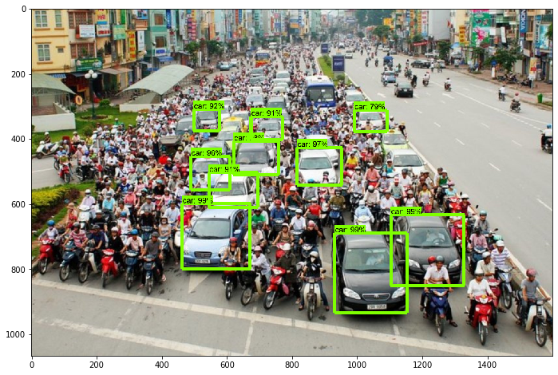
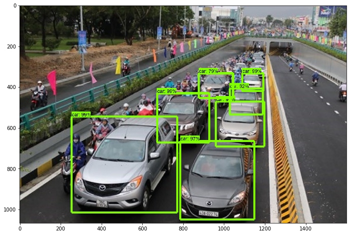
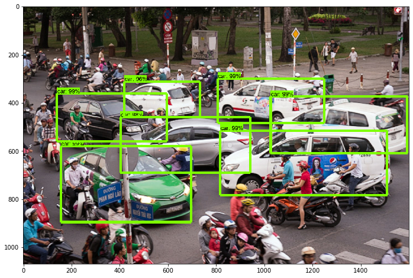
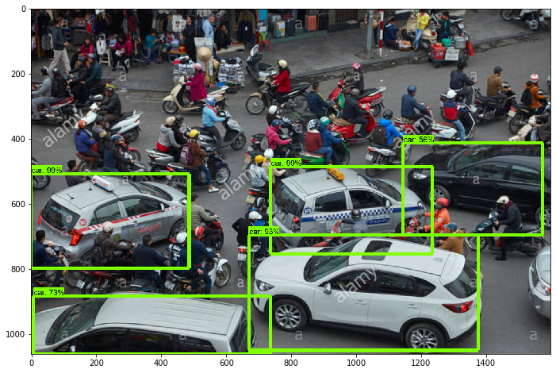
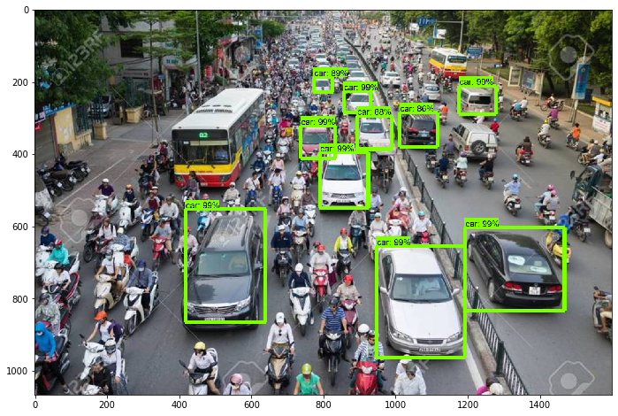

# Car Detection using Tensorflow API

This repository is my first work on Computer Vision field. I faced many problems and also learned so much from Tensorflow API.
For the instructions, refer my first blog at [here](https://tech.3si.vn/2019/04/12/detailed-roadmap-for-tensorflow-object-detection-api/).

# Result

I tested my model with some practical images about traffic on rush hours at Hanoi. And here are some of my results.

